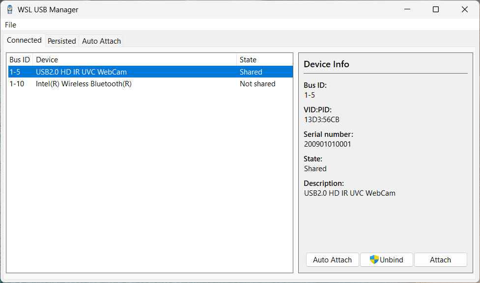
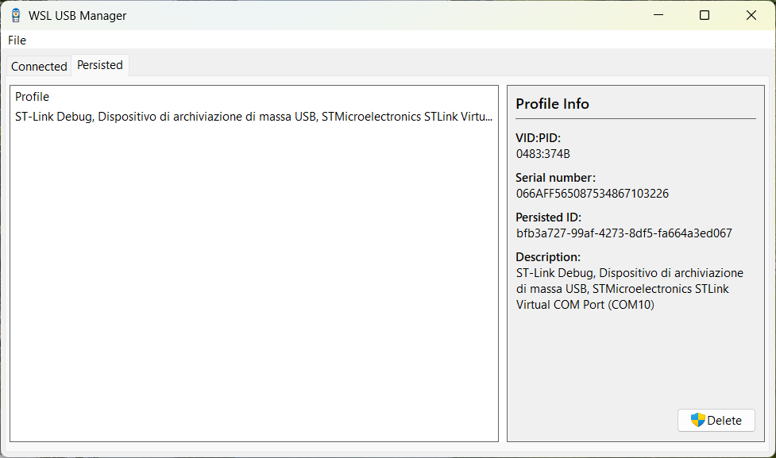
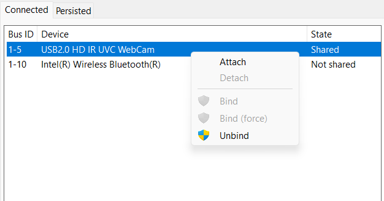

    

# WSL USB Manager

A fast and light GUI for [`usbipd-win`](https://github.com/dorssel/usbipd-win).
Manage connecting USB devices to WSL with an intuitive UI.

    

## Features

- Bind and unbind USB devices
- Attach and detach USB devices to WSL
- Manage persisted devices
- Tray icon for quick access, minimizes to tray on close
- Auto-attach profiles
    - Uses `usbipd attach --auto-attach` behind the scenes
    - Requires devices to be bound first
    - Auto-attach profiles are reset every time the application is restarted
- Lightweight:
    - Fast startup times (less than 1 second)
    - Low memory usage (less than 3 MB)
    - Small binary size (less than 1 MB)

## Installation

> [!IMPORTANT]  
> `usbipd-win` version **4.0.0** or newer is strongly recommended for this software to work properly.
> Older versions have not been tested and may not work.

This software requires Microsoft Windows 10 (64-bit only), version 1809 or newer.

Download the latest release from the [releases page](https://github.com/lynxnb/wsl-usb-manager/releases).
Run the executable to start the application.

## Roadmap

- Auto-attach profiles
    - UI dialog for creating and editing profiles
    - Background service for auto-attaching devices
- Provide an installer and add to `winget`
    - Option to setup logon startup to tray icon

## Support

If you encounter any issues, please open a [GitHub issue](https://github.com/lynxnb/wsl-usb-manager/issues).

## Screenshots

     
    

